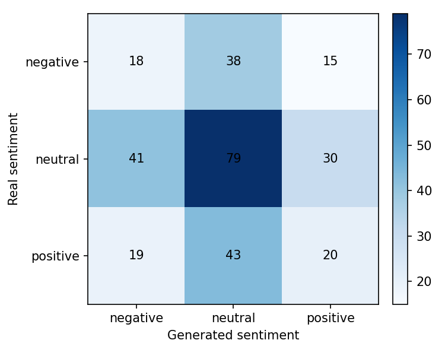
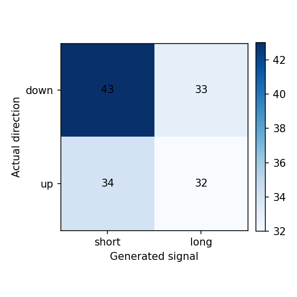

# Reporte del experimento

## Resumen

Este experimento fine-tunea `gpt2` para generar narrativas financieras de `QQQ, SPY` para el dia `t+1`, usando noticias y features de mercado de una ventana previa de `3` dias.

- Run: `2026-04-30_15-49-24_spy-qqq_gpt2_spy-qqq-baseline`
- Estado: `completed`
- Duracion: `34075.5` segundos

Tiempos por etapa:

| Etapa | Segundos |
|---|---:|
| download_data | 41.9607 |
| build_dataset | 3.2706 |
| train_model | 33528.4905 |
| generate_predictions | 458.5248 |
| evaluate | 42.7676 |

## Datos

- Dataset: `beachside1234/FNSPID`
- Activos configurados: `SPY, QQQ`
- Activos presentes en predicciones: `QQQ, SPY`
- Rango configurado: `2017-08-18` a `2023-12-16`
- Splits procesados: train=1410, val=302, test=303
- Predicciones evaluadas: 303

## Metodo

- Formato de entrada: ticker, fecha, retorno diario, volumen relativo, RSI y noticias previas.
- Target: titulares/noticias del dia calendario siguiente.
- Entrenamiento: causal language modeling con perdida enmascarada sobre el prompt.
- Modelo base: `gpt2`
- Epocas: `3`
- Learning rate: `5e-05`
- Decoding: `do_sample=False`, `max_new_tokens=120`

## Resultados Textuales

| Metrica | Media |
|---|---:|
| ROUGE-1 | 0.0788 |
| ROUGE-2 | 0.0083 |
| ROUGE-L | 0.0615 |
| BERTScore P | 0.7301 |
| BERTScore R | 0.7341 |
| BERTScore F1 | 0.7318 |

Lectura: ROUGE bajo indica poca coincidencia literal con las noticias reales. BERTScore moderado sugiere cercania semantica general, probablemente influida por vocabulario financiero compartido.

## Resultados Semanticos

| Metrica | Valor |
|---|---:|
| Sentiment match accuracy | 0.3861 |
| Neutral baseline accuracy | 0.4950 |
| Mean KL divergence | 1.3882 |
| Net sentiment Pearson | 0.0172 |

Matriz real vs generado segun FinBERT:

| Real \ Generado | negative | neutral | positive |
|---|---:|---:|---:|
| negative | 18 | 38 | 15 |
| neutral | 41 | 79 | 30 |
| positive | 19 | 43 | 20 |

Lectura: el modelo tiende a neutralizar el tono. La evaluacion semantica no supera el baseline trivial de predecir siempre neutral.

## Resultados Financieros

| Metrica | Valor |
|---|---:|
| Filas joineadas | 301.0000 |
| Directional accuracy generado | 0.5282 |
| Directional accuracy noticia real | 0.5882 |
| Cobertura senal generada | 0.4718 |
| Cobertura senal real | 0.5083 |
| Accuracy alta volatilidad | 0.5068 |
| Accuracy baja volatilidad | 0.5507 |

Lectura: cuando el modelo genera una senal no neutral, la precision direccional es razonable, pero la cobertura es baja. Esto debe interpretarse como una senal selectiva, no como una estrategia completa.

## Ejemplos Cualitativos

### Caso con buena similitud textual

- Fecha target: `2023-05-12`
- Sentimiento real/generado: `positive` / `neutral`
- Direccion real/senal generada: `-1.0` / `0.0`

**Noticia real:**

> - Import Prices Rebound to +0.4%; Consumer Sentiment After Open
> - After Hours Most Active for May 12, 2023 : QQQ, GSIT, ENB, TCOM, GOOG, EB, VICI, DAL, AQUA, NIO, FOLD, IOVA

**Noticia generada:**

> - After Hours Most Active for May 12 : GE AAPL XOM TSLA MSFTY; AMD INTCX VZHUJG

### Caso con sentimiento coincidente

- Fecha target: `2023-03-30`
- Sentimiento real/generado: `neutral` / `neutral`
- Direccion real/senal generada: `1.0` / `0.0`

**Noticia real:**

> - Mini-Rally in Place Ahead of Q1 End, PCE Numbers
> - After Hours Most Active for Mar 30, 2023 : AUY, GOOGL, QQQ, EVTL, AAPL, MSFT, WFC, AMAT, ALIT, NVTS, JBGS, BK
> - QQQ, PEP, CSCO, TMUS: Large Inflows Detected at ETF

**Noticia generada:**

> - After Hours Most Active For Jan 2nd : SQQLYU; TSLAOZFJGKHWVNGLFYBMC

### Caso con senal financiera correcta

- Fecha target: `2023-03-29`
- Sentimiento real/generado: `neutral` / `positive`
- Direccion real/senal generada: `1.0` / `1.0`

**Noticia real:**

> - About to Put a Bow on Q1: Another Up-Day
> - Is SPDR Russell 1000 Momentum Focus ETF (ONEO) a Strong ETF Right Now?
> - 2 Reasons Why Advisors Are Using NightShares ETFs

**Noticia generada:**

> -'Investors are betting big' that Apple and Microsoft will win election this November; Dow Jones & Co Shares Cross 3%, Nasdaq Up 1%.

## Limitaciones

- GPT-2 small tiene capacidad limitada y tiende a generar titulares genericos.
- El target usa titulares agregados por dia, no articulos completos curados.
- FinBERT mide tono financiero, pero no garantiza causalidad ni prediccion de precio.
- La metrica financiera usa una regla simple de sentimiento a long/short/hold.
- La muestra de test es chica para concluir robustez estadistica.

## Proximos Experimentos

- Comparar contra mas epochs y contra GPT-2 medium si hay VRAM.
- Probar prompts mas estructurados con menos titulares y features mas claras.
- Ajustar decoding para reducir titulares clickbait/genericos.
- Extender a varios ETFs/tickers cuando el pipeline este estable.
- Agregar una tabla comparativa entre carpetas `runs/`.
