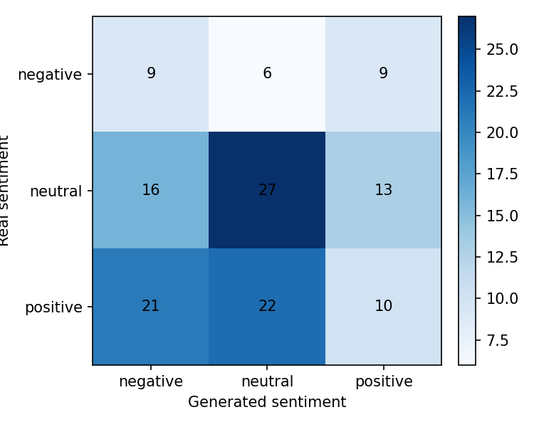
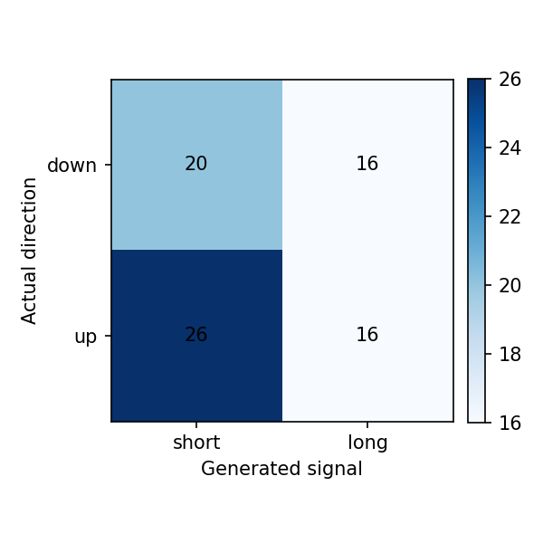

# Reporte del experimento

## Resumen

Este experimento fine-tunea `gpt2` para generar narrativas financieras de `NVDA` para el dia `t+1`, usando noticias y features de mercado de una ventana previa de `3` dias.

- Run: `2026-05-02_13-05-30_nvda_gpt2_nvda-single`
- Estado: `completed`
- Duracion: `14662.4` segundos

Tiempos por etapa:

| Etapa | Segundos |
|---|---:|
| download_data | 22.9644 |
| build_dataset | 2.3792 |
| train_model | 14411.1412 |
| generate_predictions | 208.5087 |
| evaluate | 17.3820 |

## Datos

- Dataset: `beachside1234/FNSPID`
- Activos configurados: `NVDA`
- Activos presentes en predicciones: `NVDA`
- Rango configurado: `2017-08-18` a `2023-12-16`
- Splits procesados: train=618, val=132, test=133
- Predicciones evaluadas: 133

## Metodo

- Formato de entrada: ticker, fecha, retorno diario, volumen relativo, RSI y noticias previas.
- Target: titulares/noticias del dia calendario siguiente.
- Entrenamiento: causal language modeling con perdida enmascarada sobre el prompt.
- Modelo base: `gpt2`
- Epocas: `3`
- Learning rate: `5e-05`
- Decoding: `do_sample=False`, `max_new_tokens=120`

## Resultados Textuales

| Metrica | Media |
|---|---:|
| ROUGE-1 | 0.0953 |
| ROUGE-2 | 0.0049 |
| ROUGE-L | 0.0697 |
| BERTScore P | 0.7391 |
| BERTScore R | 0.7487 |
| BERTScore F1 | 0.7438 |

Lectura: ROUGE bajo indica poca coincidencia literal con las noticias reales. BERTScore moderado sugiere cercania semantica general, probablemente influida por vocabulario financiero compartido.

## Resultados Semanticos

| Metrica | Valor |
|---|---:|
| Sentiment match accuracy | 0.3459 |
| Neutral baseline accuracy | 0.4211 |
| Mean KL divergence | 1.7027 |
| Net sentiment Pearson | -0.1143 |

Matriz real vs generado segun FinBERT:

| Real \ Generado | negative | neutral | positive |
|---|---:|---:|---:|
| negative | 9 | 6 | 9 |
| neutral | 16 | 27 | 13 |
| positive | 21 | 22 | 10 |

Lectura: el modelo tiende a neutralizar el tono. La evaluacion semantica no supera el baseline trivial de predecir siempre neutral.

## Resultados Financieros

| Metrica | Valor |
|---|---:|
| Filas joineadas | 132.0000 |
| Directional accuracy generado | 0.4615 |
| Directional accuracy noticia real | 0.6753 |
| Cobertura senal generada | 0.5909 |
| Cobertura senal real | 0.5833 |
| Accuracy alta volatilidad | 0.4848 |
| Accuracy baja volatilidad | 0.4444 |

Lectura: cuando el modelo genera una senal no neutral, la precision direccional es razonable, pero la cobertura es baja. Esto debe interpretarse como una senal selectiva, no como una estrategia completa.

## Ejemplos Cualitativos

### Caso con buena similitud textual

- Fecha target: `2023-07-04`
- Sentimiento real/generado: `neutral` / `positive`
- Direccion real/senal generada: `-1.0` / `1.0`

**Noticia real:**

> - Amdocs (DOX) Acquires TEOCO Service Assurance Business Unit
> - The 3 Best Metaverse Stocks to Buy in July
> - The 3 Best AI Stocks to Buy in July

**Noticia generada:**

> - NVIDIA Shares Are Up 52%, But Why Is This Important For The Metaverse Today ?
> - 10 Best Crypto ETFs To Buy Now Right From Yesterday

### Caso con sentimiento coincidente

- Fecha target: `2023-06-14`
- Sentimiento real/generado: `neutral` / `neutral`
- Direccion real/senal generada: `1.0` / `0.0`

**Noticia real:**

> - EXCLUSIVE-Amazon's cloud unit is considering AMD's new AI chips
> - Cathie Wood Thinks This AI Semiconductor Stock Is a Better Buy Than Nvidia
> - If You Love Microsoft Stock, Youll Love This ETF

**Noticia generada:**

> - Why NVIDIA and AMD Are Moving In Different Ways This Year...and What You Should Know About These 2 Companies' Future Plans
> 
> /scoop

### Caso con senal financiera correcta

- Fecha target: `2023-06-15`
- Sentimiento real/generado: `negative` / `negative`
- Direccion real/senal generada: `-1.0` / `-1.0`

**Noticia real:**

> - NVIDIA (NVDA) Joins $1T Club: What's Behind the 196% YTD Rally?
> - First Citizen Bancshares and Icahn have been highlighted as Zacks Bull and Bear of the Day
> - Wall Street set to fall at open as Fed foresees further rate hikes

**Noticia generada:**

> - Why NVIDIA and Qualcomm Are Falling in Price Today...and What It Means for Investors Right Now
> - 10 Best Technology Companies To Invest In Before 2020

## Limitaciones

- GPT-2 small tiene capacidad limitada y tiende a generar titulares genericos.
- El target usa titulares agregados por dia, no articulos completos curados.
- FinBERT mide tono financiero, pero no garantiza causalidad ni prediccion de precio.
- La metrica financiera usa una regla simple de sentimiento a long/short/hold.
- La muestra de test es chica para concluir robustez estadistica.

## Proximos Experimentos

- Comparar contra mas epochs y contra GPT-2 medium si hay VRAM.
- Probar prompts mas estructurados con menos titulares y features mas claras.
- Ajustar decoding para reducir titulares clickbait/genericos.
- Extender a varios ETFs/tickers cuando el pipeline este estable.
- Agregar una tabla comparativa entre carpetas `runs/`.
