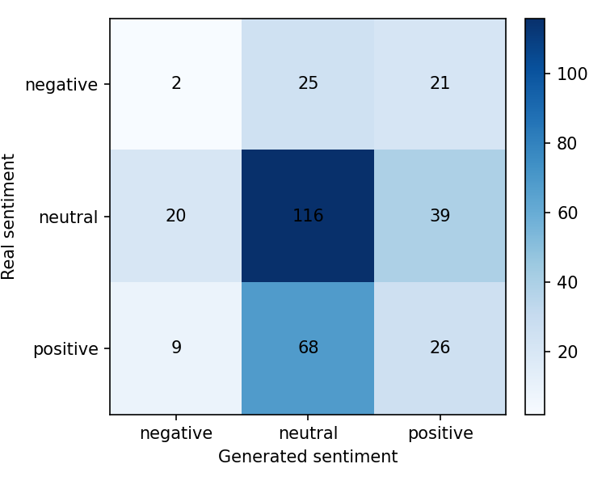
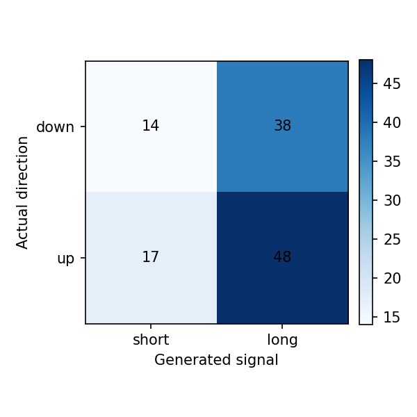

# Reporte del experimento

## Resumen

Este experimento fine-tunea `gpt2` para generar narrativas financieras de `AMD, NVDA` para el dia `t+1`, usando noticias y features de mercado de una ventana previa de `3` dias.

- Run: `2026-05-03_01-12-20_nvda-amd_gpt2_nvda-ambd-gpt2`
- Estado: `completed`
- Duracion: `35978.4` segundos

Tiempos por etapa:

| Etapa | Segundos |
|---|---:|
| download_data | 114.5585 |
| build_dataset | 4.3415 |
| train_model | 35299.4754 |
| generate_predictions | 520.2850 |
| evaluate | 39.2905 |

## Datos

- Dataset: `beachside1234/FNSPID`
- Activos configurados: `NVDA, AMD`
- Activos presentes en predicciones: `AMD, NVDA`
- Rango configurado: `2017-08-18` a `2023-12-16`
- Splits procesados: train=1517, val=325, test=326
- Predicciones evaluadas: 326

## Metodo

- Formato de entrada: ticker, fecha, retorno diario, volumen relativo, RSI y noticias previas.
- Target: titulares/noticias del dia calendario siguiente.
- Entrenamiento: causal language modeling con perdida enmascarada sobre el prompt.
- Modelo base: `gpt2`
- Epocas: `3`
- Learning rate: `5e-05`
- Decoding: `do_sample=False`, `max_new_tokens=120`

## Resultados Textuales

| Metrica | Media |
|---|---:|
| ROUGE-1 | 0.1014 |
| ROUGE-2 | 0.0063 |
| ROUGE-L | 0.0736 |
| BERTScore P | 0.7341 |
| BERTScore R | 0.7428 |
| BERTScore F1 | 0.7383 |

Lectura: ROUGE bajo indica poca coincidencia literal con las noticias reales. BERTScore moderado sugiere cercania semantica general, probablemente influida por vocabulario financiero compartido.

## Resultados Semanticos

| Metrica | Valor |
|---|---:|
| Sentiment match accuracy | 0.4417 |
| Neutral baseline accuracy | 0.5368 |
| Mean KL divergence | 1.2727 |
| Net sentiment Pearson | -0.0992 |

Matriz real vs generado segun FinBERT:

| Real \ Generado | negative | neutral | positive |
|---|---:|---:|---:|
| negative | 2 | 25 | 21 |
| neutral | 20 | 116 | 39 |
| positive | 9 | 68 | 26 |

Lectura: el modelo tiende a neutralizar el tono. La evaluacion semantica no supera el baseline trivial de predecir siempre neutral.

## Resultados Financieros

| Metrica | Valor |
|---|---:|
| Filas joineadas | 324.0000 |
| Directional accuracy generado | 0.5299 |
| Directional accuracy noticia real | 0.6400 |
| Cobertura senal generada | 0.3611 |
| Cobertura senal real | 0.4630 |
| Accuracy alta volatilidad | 0.4630 |
| Accuracy baja volatilidad | 0.5873 |

Lectura: cuando el modelo genera una senal no neutral, la precision direccional es razonable, pero la cobertura es baja. Esto debe interpretarse como una senal selectiva, no como una estrategia completa.

## Ejemplos Cualitativos

### Caso con buena similitud textual

- Fecha target: `2023-12-15`
- Sentimiento real/generado: `neutral` / `neutral`
- Direccion real/senal generada: `1.0` / `0.0`

**Noticia real:**

> - Can Nvidia Stock Hit $1,000 in 2024?
> - 3 Growth Stocks to Buy and Hold Forever
> - Why Intel Stock Popped Today

**Noticia generada:**

> - Why AMD Is a Buy Now and Hold On Forever...and What It Means For NVIDIA Investors Today
> 
> /rblinkflux via CNBC / Bloomberg

### Caso con sentimiento coincidente

- Fecha target: `2023-04-19`
- Sentimiento real/generado: `positive` / `positive`
- Direccion real/senal generada: `1.0` / `1.0`

**Noticia real:**

> - Nvidia Is a Top Stock to Bet On in Quantum Computing
> - Silicon Selections: 3 Strong Buy Semiconductor Stocks to Watch
> - TMF, FTGS: Big ETF Inflows

**Noticia generada:**

> - Advanced Micro Devices shares are trading higher after a strong Q2 earnings report from Micron Technology Co., which provided guidance on its semiconductor business ahead of Wednesday's session closing at $1 billion above analyst estimates.

### Caso con senal financiera correcta

- Fecha target: `2023-04-19`
- Sentimiento real/generado: `negative` / `positive`
- Direccion real/senal generada: `1.0` / `1.0`

**Noticia real:**

> - Could AI Demand Boost High-End Consumer Products From Intel, AMD, and Nvidia?
> - PC Unit Sales Plunge in Q1, and TSMC Feels the Effects

**Noticia generada:**

> ...And Now This Is Why Nvidia's Earnings Beat Estimates by 1%, Says Analyst on Twitter
> 
> "Guru has been trading higher than expected and the market is in good shape as investors continue to weigh options."

## Limitaciones

- GPT-2 small tiene capacidad limitada y tiende a generar titulares genericos.
- El target usa titulares agregados por dia, no articulos completos curados.
- FinBERT mide tono financiero, pero no garantiza causalidad ni prediccion de precio.
- La metrica financiera usa una regla simple de sentimiento a long/short/hold.
- La muestra de test es chica para concluir robustez estadistica.

## Proximos Experimentos

- Comparar contra mas epochs y contra GPT-2 medium si hay VRAM.
- Probar prompts mas estructurados con menos titulares y features mas claras.
- Ajustar decoding para reducir titulares clickbait/genericos.
- Extender a varios ETFs/tickers cuando el pipeline este estable.
- Agregar una tabla comparativa entre carpetas `runs/`.
