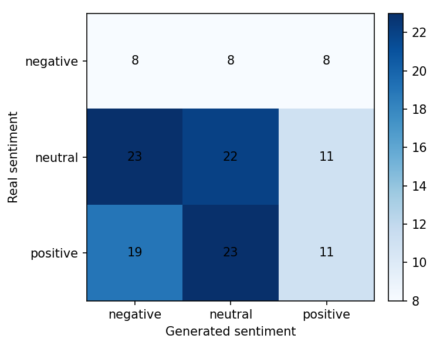
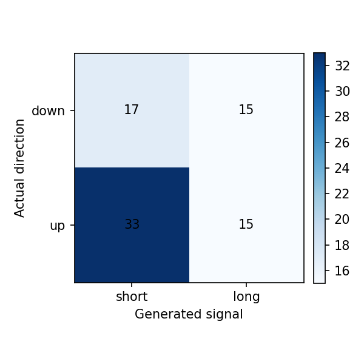

# Reporte del experimento

## Resumen

Este experimento fine-tunea `gpt2` para generar narrativas financieras de `NVDA` para el dia `t+1`, usando noticias y features de mercado de una ventana previa de `3` dias.

- Run: `2026-05-03_12-41-00_nvda_gpt2_nvda-structured-prompt`
- Estado: `completed`
- Duracion: `18226.0` segundos

Tiempos por etapa:

| Etapa | Segundos |
|---|---:|
| download_data | 67.8307 |
| build_dataset | 2.4542 |
| train_model | 13394.6399 |
| generate_predictions | 213.3263 |
| evaluate | 15.3646 |

## Datos

- Dataset: `beachside1234/FNSPID`
- Activos configurados: `NVDA`
- Activos presentes en predicciones: `NVDA`
- Rango configurado: `2017-08-18` a `2023-12-16`
- Splits procesados: train=617, val=132, test=133
- Predicciones evaluadas: 133

## Metodo

- Formato de entrada: ticker, fecha, retorno diario, volumen relativo, RSI y noticias previas.
- Target: outlook estructurado del dia siguiente con sentimiento, direccion y narrativa.
- Entrenamiento: causal language modeling con perdida enmascarada sobre el prompt.
- Modelo base: `gpt2`
- Epocas: `3`
- Learning rate: `5e-05`
- Decoding: `do_sample=False`, `max_new_tokens=120`

## Resultados Textuales

| Metrica | Media |
|---|---:|
| ROUGE-1 | 0.0472 |
| ROUGE-2 | 0.0020 |
| ROUGE-L | 0.0353 |
| BERTScore P | n/a |
| BERTScore R | n/a |
| BERTScore F1 | n/a |

Lectura: ROUGE bajo indica poca coincidencia literal con las noticias reales. BERTScore moderado sugiere cercania semantica general, probablemente influida por vocabulario financiero compartido.

## Resultados Semanticos

| Metrica | Valor |
|---|---:|
| Sentiment match accuracy | 0.3083 |
| Structured sentiment match accuracy | 0.5414 |
| Neutral baseline accuracy | 0.4211 |
| Mean KL divergence | 1.7691 |
| Net sentiment Pearson | -0.0160 |

Matriz real vs generado segun FinBERT:

| Real \ Generado | negative | neutral | positive |
|---|---:|---:|---:|
| negative | 8 | 8 | 8 |
| neutral | 23 | 22 | 11 |
| positive | 19 | 23 | 11 |

Lectura: el modelo tiende a neutralizar el tono. La evaluacion semantica no supera el baseline trivial de predecir siempre neutral.

## Resultados Financieros

| Metrica | Valor |
|---|---:|
| Filas joineadas | 133.0000 |
| Directional accuracy generado | 0.4000 |
| Directional accuracy noticia real | 0.6753 |
| Cobertura senal generada | 0.6015 |
| Cobertura senal real | 0.5789 |
| Accuracy alta volatilidad | 0.4186 |
| Accuracy baja volatilidad | 0.3784 |

Lectura: cuando el modelo genera una senal no neutral, la precision direccional es razonable, pero la cobertura es baja. Esto debe interpretarse como una senal selectiva, no como una estrategia completa.

## Ejemplos Cualitativos

### Caso con buena similitud textual

- Fecha target: `2023-08-24`
- Sentimiento real/generado: `neutral` / `negative`
- Direccion real/senal generada: `1` / `-1`

**Noticia real:**

> - 3 Vanguard ETFs That Could Help You Retire a Millionaire
> - S&P 500 Analyst Moves: NVDA
> - UBS Maintains NVIDIA (NVDA) Buy Recommendation

**Noticia generada:**

> Sentiment down slightly from positive after Nasdaq reported strong sales growth despite weak earnings guidance... read more
>  - 7 Technology Companies That Could Be a Buy Now

### Caso con sentimiento coincidente

- Fecha target: `2023-06-21`
- Sentimiento real/generado: `neutral` / `neutral`
- Direccion real/senal generada: `-1` / `0`

**Noticia real:**

> - Q2 Earnings: An Early Preview
> - 2 Top AI Stocks To Watch In June 2023
> - 7 Chip Stocks to Buy if You Missed Out on NVDA

**Noticia generada:**

### Caso con senal financiera correcta

- Fecha target: `2023-06-14`
- Sentimiento real/generado: `neutral` / `positive`
- Direccion real/senal generada: `1` / `1`

**Noticia real:**

> - EXCLUSIVE-Amazon's cloud unit is considering AMD's new AI chips
> - Cathie Wood Thinks This AI Semiconductor Stock Is a Better Buy Than Nvidia
> - If You Love Microsoft Stock, Youll Love This ETF

**Noticia generada:**

> Narrative': [Full text of Q1 earnings report]: NVIDIA shares have been trading higher as investors look ahead toward a potentially volatile stock market and broader economic downturns

## Limitaciones

- GPT-2 small tiene capacidad limitada y tiende a generar titulares genericos.
- El target usa titulares agregados por dia, no articulos completos curados.
- FinBERT mide tono financiero, pero no garantiza causalidad ni prediccion de precio.
- La metrica financiera usa la direccion estructurada generada cuando esta disponible.
- La muestra de test es chica para concluir robustez estadistica.

## Proximos Experimentos

- Comparar contra mas epochs y contra GPT-2 medium si hay VRAM.
- Probar prompts mas estructurados con menos titulares y features mas claras.
- Ajustar decoding para reducir titulares clickbait/genericos.
- Extender a varios ETFs/tickers cuando el pipeline este estable.
- Agregar una tabla comparativa entre carpetas `runs/`.
