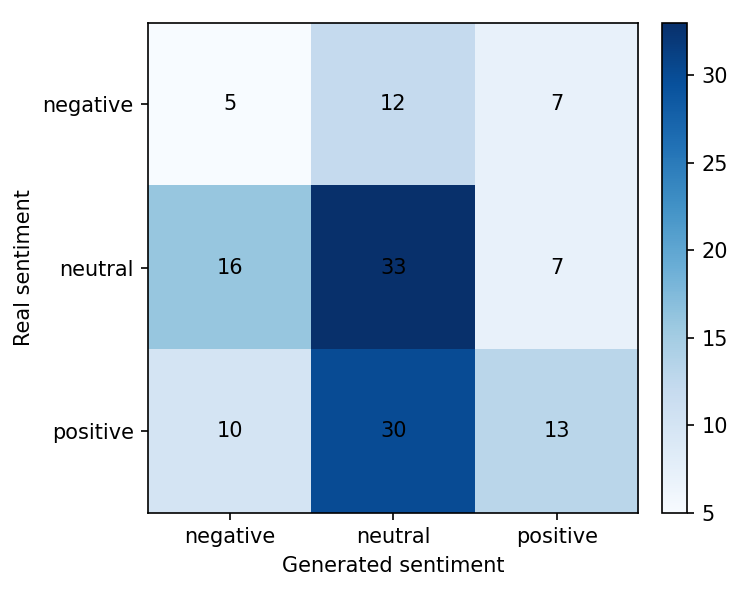
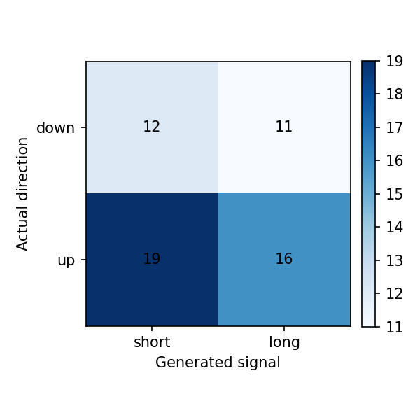

# Reporte del experimento

## Resumen

Este experimento fine-tunea `gpt2` para generar narrativas financieras de `NVDA` para el dia `t+1`, usando noticias y features de mercado de una ventana previa de `3` dias.

- Run: `2026-05-04_00-31-31_nvda_gpt2_nvda-tagged-structured-prompt`
- Estado: `completed`
- Duracion: `13488.6` segundos

Tiempos por etapa:

| Etapa | Segundos |
|---|---:|
| download_data | 29.0429 |
| build_dataset | 2.5017 |
| train_model | 13157.5375 |
| generate_predictions | 266.8199 |
| evaluate | 32.6566 |

## Datos

- Dataset: `beachside1234/FNSPID`
- Activos configurados: `NVDA`
- Activos presentes en predicciones: `NVDA`
- Rango configurado: `2017-08-18` a `2023-12-16`
- Splits procesados: train=617, val=132, test=133
- Predicciones evaluadas: 133

## Metodo

- Formato de entrada: ticker, fecha, retorno diario, volumen relativo, RSI y noticias previas.
- Target: outlook estructurado del dia siguiente con sentimiento, direccion y narrativa.
- Entrenamiento: causal language modeling con perdida enmascarada sobre el prompt.
- Modelo base: `gpt2`
- Epocas: `3`
- Learning rate: `5e-05`
- Decoding: `do_sample=False`, `max_new_tokens=120`

## Resultados Textuales

| Metrica | Media |
|---|---:|
| ROUGE-1 | 0.0520 |
| ROUGE-2 | 0.0012 |
| ROUGE-L | 0.0421 |
| BERTScore P | 0.6682 |
| BERTScore R | 0.7074 |
| BERTScore F1 | 0.6870 |

Lectura: ROUGE bajo indica poca coincidencia literal con las noticias reales. BERTScore moderado sugiere cercania semantica general, probablemente influida por vocabulario financiero compartido.

## Resultados Semanticos

| Metrica | Valor |
|---|---:|
| Sentiment match accuracy | 0.3835 |
| Structured sentiment match accuracy | 0.0000 |
| Neutral baseline accuracy | 0.4211 |
| Mean KL divergence | 1.6179 |
| Net sentiment Pearson | 0.0450 |

Matriz real vs generado segun FinBERT:

| Real \ Generado | negative | neutral | positive |
|---|---:|---:|---:|
| negative | 5 | 12 | 7 |
| neutral | 16 | 33 | 7 |
| positive | 10 | 30 | 13 |

Lectura: el modelo tiende a neutralizar el tono. La evaluacion semantica no supera el baseline trivial de predecir siempre neutral.

## Resultados Financieros

| Metrica | Valor |
|---|---:|
| Filas joineadas | 133.0000 |
| Directional accuracy generado | 0.4828 |
| Directional accuracy noticia real | 0.6753 |
| Cobertura senal generada | 0.4361 |
| Cobertura senal real | 0.5789 |
| Accuracy alta volatilidad | 0.5385 |
| Accuracy baja volatilidad | 0.4375 |

Lectura: cuando el modelo genera una senal no neutral, la precision direccional es razonable, pero la cobertura es baja. Esto debe interpretarse como una senal selectiva, no como una estrategia completa.

## Ejemplos Cualitativos

### Caso con buena similitud textual

- Fecha target: `2023-11-04`
- Sentimiento real/generado: `neutral` / `neutral`
- Direccion real/senal generada: `1` / `0`

**Noticia real:**

> - These 2 Artificial Intelligence (AI) Stocks Have a Lot to Prove Before I'm Willing to Buy
> - 1 Massive Reason to Buy Nvidia Stock Right Now, and It's Not Artificial Intelligence (AI)

**Noticia generada:**

> {s=neutral} [DEFAULT="up"] } 1 2 Addendum - 10 Reasons Why NVIDIA Stock Could Be a Buy Now or Later...

### Caso con sentimiento coincidente

- Fecha target: `2023-06-14`
- Sentimiento real/generado: `neutral` / `neutral`
- Direccion real/senal generada: `1` / `0`

**Noticia real:**

> - EXCLUSIVE-Amazon's cloud unit is considering AMD's new AI chips
> - Cathie Wood Thinks This AI Semiconductor Stock Is a Better Buy Than Nvidia
> - If You Love Microsoft Stock, Youll Love This ETF

**Noticia generada:**

> {up} [CONTINUE]: 0; SORT=neutral } {open}: 2s;} [] ASKED QUESTIONS? Ask at our Q&A Session

### Caso con senal financiera correcta

- Fecha target: `2023-06-08`
- Sentimiento real/generado: `neutral` / `positive`
- Direccion real/senal generada: `1` / `1`

**Noticia real:**

> - Zacks Earnings Trends Highlights: Meta Platforms and Nvidia
> - AI Could Send These 2 Nasdaq Stocks to the Moon
> - Apple Stock is on Fire. Invest in it with These 3 ETFs

**Noticia generada:**

> {up}=down;comment=-1 } [PENNY/MUSIC]: Semiconductor stocks are trading higher after a strong earnings report from Micron and Nvidia that highlighted continued growth in semiconductors manufacturing as well as new technology development."

## Limitaciones

- GPT-2 small tiene capacidad limitada y tiende a generar titulares genericos.
- El target usa titulares agregados por dia, no articulos completos curados.
- FinBERT mide tono financiero, pero no garantiza causalidad ni prediccion de precio.
- La metrica financiera usa la direccion estructurada generada cuando esta disponible.
- La muestra de test es chica para concluir robustez estadistica.

## Proximos Experimentos

- Comparar contra mas epochs y contra GPT-2 medium si hay VRAM.
- Probar prompts mas estructurados con menos titulares y features mas claras.
- Ajustar decoding para reducir titulares clickbait/genericos.
- Extender a varios ETFs/tickers cuando el pipeline este estable.
- Agregar una tabla comparativa entre carpetas `runs/`.
