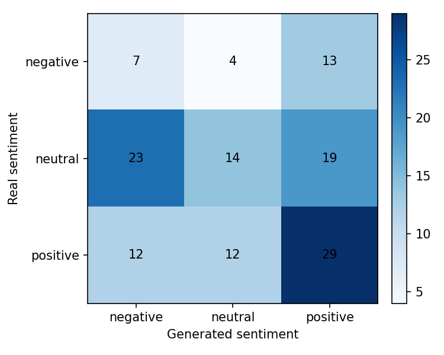
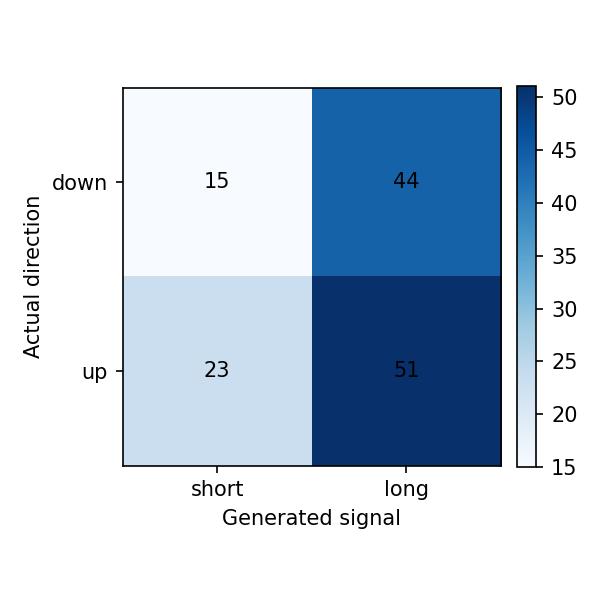

# Reporte del experimento

## Resumen

Este experimento fine-tunea `gpt2` para generar narrativas financieras de `NVDA` para el dia `t+1`, usando noticias y features de mercado de una ventana previa de `3` dias.

- Run: `2026-05-04_09-09-04_nvda_gpt2_nvda-label-scoring`
- Estado: `completed`
- Duracion: `14309.6` segundos

Tiempos por etapa:

| Etapa | Segundos |
|---|---:|
| download_data | 45.9343 |
| build_dataset | 2.4263 |
| train_model | 13758.9742 |
| generate_predictions | 479.3297 |
| evaluate | 22.9250 |

## Datos

- Dataset: `beachside1234/FNSPID`
- Activos configurados: `NVDA`
- Activos presentes en predicciones: `NVDA`
- Rango configurado: `2017-08-18` a `2023-12-16`
- Splits procesados: train=617, val=132, test=133
- Predicciones evaluadas: 133

## Metodo

- Formato de entrada: ticker, fecha, retorno diario, volumen relativo, RSI y noticias previas.
- Target: outlook estructurado del dia siguiente con sentimiento, direccion y narrativa.
- Entrenamiento: causal language modeling con perdida enmascarada sobre el prompt.
- Modelo base: `gpt2`
- Epocas: `3`
- Learning rate: `5e-05`
- Decoding: `do_sample=False`, `max_new_tokens=120`

## Resultados Textuales

| Metrica | Media |
|---|---:|
| ROUGE-1 | 0.0989 |
| ROUGE-2 | 0.0029 |
| ROUGE-L | 0.0664 |
| BERTScore P | 0.7334 |
| BERTScore R | 0.7475 |
| BERTScore F1 | 0.7401 |

Lectura: ROUGE bajo indica poca coincidencia literal con las noticias reales. BERTScore moderado sugiere cercania semantica general, probablemente influida por vocabulario financiero compartido.

## Resultados Semanticos

| Metrica | Valor |
|---|---:|
| Sentiment match accuracy | 0.3759 |
| Structured sentiment match accuracy | 0.7444 |
| Neutral baseline accuracy | 0.4211 |
| Mean KL divergence | 1.8225 |
| Net sentiment Pearson | 0.0050 |

Matriz real vs generado segun FinBERT:

| Real \ Generado | negative | neutral | positive |
|---|---:|---:|---:|
| negative | 7 | 4 | 13 |
| neutral | 23 | 14 | 19 |
| positive | 12 | 12 | 29 |

Lectura: el modelo tiende a neutralizar el tono. La evaluacion semantica no supera el baseline trivial de predecir siempre neutral.

## Resultados Financieros

| Metrica | Valor |
|---|---:|
| Filas joineadas | 133.0000 |
| Directional accuracy generado | 0.4962 |
| Directional accuracy noticia real | 0.6753 |
| Cobertura senal generada | 1.0000 |
| Cobertura senal real | 0.5789 |
| Accuracy alta volatilidad | 0.4925 |
| Accuracy baja volatilidad | 0.5000 |

Lectura: cuando el modelo genera una senal no neutral, la precision direccional es razonable, pero la cobertura es baja. Esto debe interpretarse como una senal selectiva, no como una estrategia completa.

## Ejemplos Cualitativos

### Caso con buena similitud textual

- Fecha target: `2023-12-01`
- Sentimiento real/generado: `neutral` / `negative`
- Direccion real/senal generada: `-1` / `1`

**Noticia real:**

> - 5 Best Performing Stocks of the Top ETF of November
> - 3 Stocks to Buy IF the Fed Indicates a Rate Hike Pause in December
> - The AI Stocks That Will Make You Money In 2024

**Noticia generada:**

> -- The Top 10 Stock Picks of 2022 -- Why AMD and Intel Are Falling in Price Target Markets Today
> - 5 Tech Companies To Watch In 2021 After Fed Raises Interest Rates

### Caso con sentimiento coincidente

- Fecha target: `2023-06-13`
- Sentimiento real/generado: `positive` / `positive`
- Direccion real/senal generada: `1` / `1`

**Noticia real:**

> - Oracle Has Spoken: The AI Cloud Is Bigger And Growing Faster
> - AI startup Synthesia gains unicorn status after Nvidia-backed fundraise
> - Apple's Most Important Announcement Last Week

**Noticia generada:**

> -$1 Billion Investors Should Know About NVIDIA and AMD Now...and Why It Will Be a Huge Growth Market by 2020
> 
> Searches of ETFs have been reported as investors begin looking at new technology stocks that could potentially be worth $2 billion or more over 10 years

### Caso con senal financiera correcta

- Fecha target: `2023-06-08`
- Sentimiento real/generado: `neutral` / `negative`
- Direccion real/senal generada: `1` / `1`

**Noticia real:**

> - Zacks Earnings Trends Highlights: Meta Platforms and Nvidia
> - AI Could Send These 2 Nasdaq Stocks to the Moon
> - Apple Stock is on Fire. Invest in it with These 3 ETFs

**Noticia generada:**

> -- Nvidia shares are trading higher after analysts reported that AMD and Intel will meet in late October at a meeting of global semiconductor companies including NVIDIA Corporation; Micron Technology Co.; Advanced Micro Devices Corp., Qualcomm Inc.'S&P 500 futures fall as investors expect lower earnings from chipmakers Huawei SA's ZTE chips while Apple AAPLA 2Q results slip amid weak sales data

## Limitaciones

- GPT-2 small tiene capacidad limitada y tiende a generar titulares genericos.
- El target usa titulares agregados por dia, no articulos completos curados.
- FinBERT mide tono financiero, pero no garantiza causalidad ni prediccion de precio.
- La metrica financiera usa la direccion estructurada generada cuando esta disponible.
- La muestra de test es chica para concluir robustez estadistica.

## Proximos Experimentos

- Comparar contra mas epochs y contra GPT-2 medium si hay VRAM.
- Probar prompts mas estructurados con menos titulares y features mas claras.
- Ajustar decoding para reducir titulares clickbait/genericos.
- Extender a varios ETFs/tickers cuando el pipeline este estable.
- Agregar una tabla comparativa entre carpetas `runs/`.
