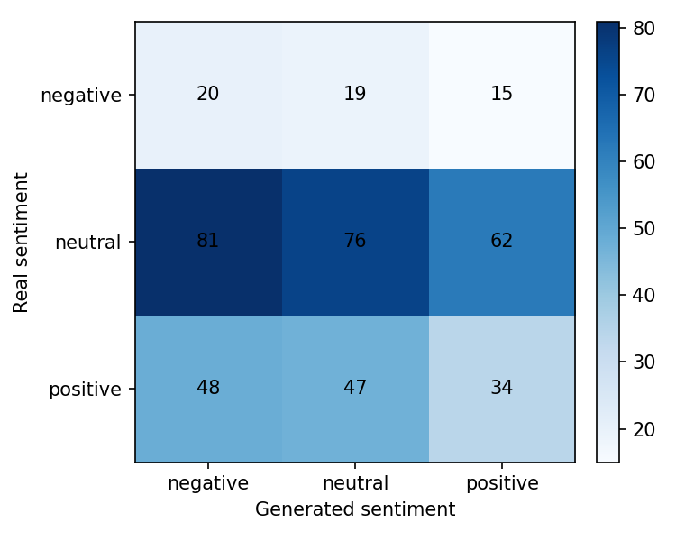
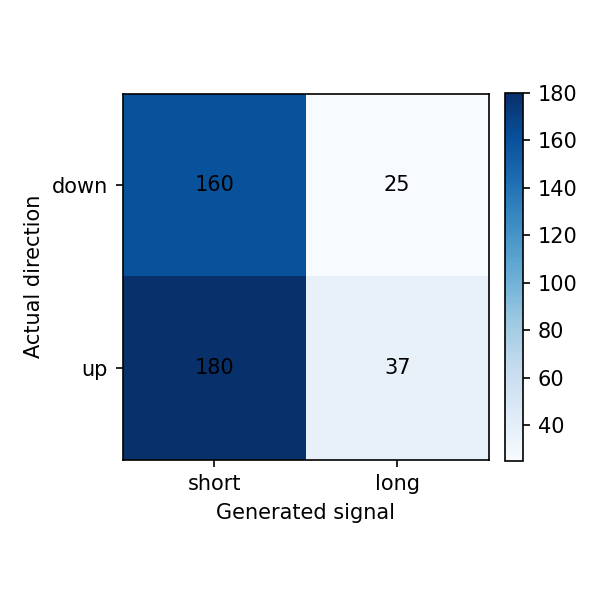

# Reporte del experimento

## Resumen

Este experimento fine-tunea `gpt2` para generar narrativas financieras de `AMD, NVDA` para el dia `t+1`, usando noticias y features de mercado de una ventana previa de `3` dias.

- Run: `2026-05-05_10-41-34_nvda-amd-avgo_gpt2_nvda-amd-avgo`
- Estado: `completed`
- Duracion: `45479.3` segundos

Tiempos por etapa:

| Etapa | Segundos |
|---|---:|
| download_data | 220.1143 |
| build_dataset | 4.6339 |
| train_model | 43988.6127 |
| generate_predictions | 1213.7549 |
| evaluate | 51.5969 |

## Datos

- Dataset: `beachside1234/FNSPID`
- Activos configurados: `NVDA, AMD, AVGO`
- Activos presentes en predicciones: `AMD, NVDA`
- Rango configurado: `2017-08-18` a `2023-12-16`
- Splits procesados: train=1869, val=400, test=402
- Predicciones evaluadas: 402

## Metodo

- Formato de entrada: ticker, fecha, retorno diario, volumen relativo, RSI y noticias previas.
- Target: outlook estructurado del dia siguiente con sentimiento, direccion y narrativa.
- Entrenamiento: causal language modeling con perdida enmascarada sobre el prompt.
- Modelo base: `gpt2`
- Epocas: `3`
- Learning rate: `5e-05`
- Decoding: `do_sample=False`, `max_new_tokens=120`

## Resultados Textuales

| Metrica | Media |
|---|---:|
| ROUGE-1 | 0.0918 |
| ROUGE-2 | 0.0038 |
| ROUGE-L | 0.0663 |
| BERTScore P | 0.7261 |
| BERTScore R | 0.7394 |
| BERTScore F1 | 0.7325 |

Lectura: ROUGE bajo indica poca coincidencia literal con las noticias reales. BERTScore moderado sugiere cercania semantica general, probablemente influida por vocabulario financiero compartido.

## Resultados Semanticos

| Metrica | Valor |
|---|---:|
| Sentiment match accuracy | 0.3234 |
| Structured sentiment match accuracy | 0.3682 |
| Neutral baseline accuracy | 0.5448 |
| Mean KL divergence | 1.8580 |
| Net sentiment Pearson | 0.0004 |

Matriz real vs generado segun FinBERT:

| Real \ Generado | negative | neutral | positive |
|---|---:|---:|---:|
| negative | 20 | 19 | 15 |
| neutral | 81 | 76 | 62 |
| positive | 48 | 47 | 34 |

Lectura: el modelo tiende a neutralizar el tono. La evaluacion semantica no supera el baseline trivial de predecir siempre neutral.

## Resultados Financieros

| Metrica | Valor |
|---|---:|
| Filas joineadas | 402.0000 |
| Directional accuracy generado | 0.4900 |
| Directional accuracy noticia real | 0.6393 |
| Cobertura senal generada | 1.0000 |
| Cobertura senal real | 0.4552 |
| Accuracy alta volatilidad | 0.5025 |
| Accuracy baja volatilidad | 0.4776 |

Lectura: cuando el modelo genera una senal no neutral, la precision direccional es razonable, pero la cobertura es baja. Esto debe interpretarse como una senal selectiva, no como una estrategia completa.

## Ejemplos Cualitativos

### Caso con buena similitud textual

- Fecha target: `2023-07-22`
- Sentimiento real/generado: `neutral` / `positive`
- Direccion real/senal generada: `-1` / `-1`

**Noticia real:**

> - Unusual Call Option Trade in Advanced Micro Devices (AMD) Worth $962.50K

**Noticia generada:**

> ... Nvidia Shares Are Still a Hot Sell as the Metaverse Turns Its Eye On Advanced Micro Devices (AMD) ... Continue Reading Below Advertisement
> 
>  -30

### Caso con sentimiento coincidente

- Fecha target: `2023-02-16`
- Sentimiento real/generado: `neutral` / `neutral`
- Direccion real/senal generada: `-1` / `-1`

**Noticia real:**

> - The 7 Best ChatGPT Stocks to Buy Now
> - Is AMD the Best Chip Stock to Buy Right Now?
> - A Bull Market Is Coming: 2 AI Stocks to Buy Right Now That Are Set to Skyrocket

**Noticia generada:**

> ... 1 Big Stock Charts For Wednesday Morning (2 Jul) 2018 ...and More!
> - Why Nvidia Is a Better Growth Company Than Intel and What It Means

## Limitaciones

- GPT-2 small tiene capacidad limitada y tiende a generar titulares genericos.
- El target usa titulares agregados por dia, no articulos completos curados.
- FinBERT mide tono financiero, pero no garantiza causalidad ni prediccion de precio.
- La metrica financiera usa la direccion estructurada generada cuando esta disponible.
- La muestra de test es chica para concluir robustez estadistica.

## Proximos Experimentos

- Comparar contra mas epochs y contra GPT-2 medium si hay VRAM.
- Probar prompts mas estructurados con menos titulares y features mas claras.
- Ajustar decoding para reducir titulares clickbait/genericos.
- Extender a varios ETFs/tickers cuando el pipeline este estable.
- Agregar una tabla comparativa entre carpetas `runs/`.
