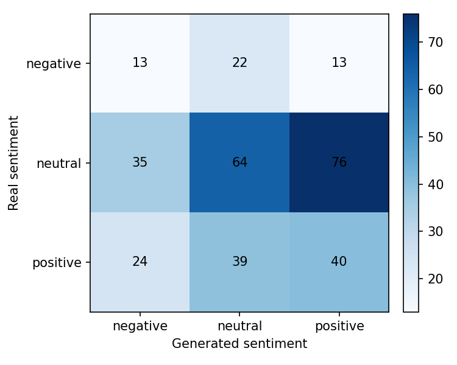
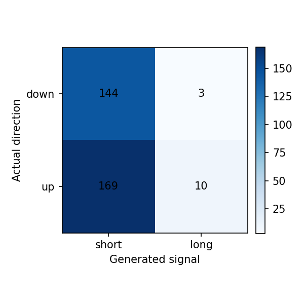

# Reporte del experimento

## Resumen

Este experimento fine-tunea `gpt2` para generar narrativas financieras de `AMD, NVDA` para el dia `t+1`, usando noticias y features de mercado de una ventana previa de `3` dias.

- Run: `2026-05-12_09-20-01_nvda-amd_gpt2_nvda-amd-label-scoring`
- Estado: `completed`
- Duracion: `37496.4` segundos

Tiempos por etapa:

| Etapa | Segundos |
|---|---:|
| download_data | 49.2444 |
| build_dataset | 4.1750 |
| train_model | 36407.7868 |
| generate_predictions | 990.5344 |
| evaluate | 44.2257 |

## Datos

- Dataset: `beachside1234/FNSPID`
- Activos configurados: `NVDA, AMD`
- Activos presentes en predicciones: `AMD, NVDA`
- Rango configurado: `2017-08-18` a `2023-12-16`
- Splits procesados: train=1516, val=324, test=326
- Predicciones evaluadas: 326

## Metodo

- Formato de entrada: ticker, fecha, retorno diario, volumen relativo, RSI y noticias previas.
- Target: outlook estructurado del dia siguiente con sentimiento, direccion y narrativa.
- Entrenamiento: causal language modeling con perdida enmascarada sobre el prompt.
- Modelo base: `gpt2`
- Epocas: `3`
- Learning rate: `5e-05`
- Decoding: `do_sample=False`, `max_new_tokens=120`

## Resultados Textuales

| Metrica | Media |
|---|---:|
| ROUGE-1 | 0.0973 |
| ROUGE-2 | 0.0049 |
| ROUGE-L | 0.0703 |
| BERTScore P | 0.7258 |
| BERTScore R | 0.7389 |
| BERTScore F1 | 0.7321 |

Lectura: ROUGE bajo indica poca coincidencia literal con las noticias reales. BERTScore moderado sugiere cercania semantica general, probablemente influida por vocabulario financiero compartido.

## Resultados Semanticos

| Metrica | Valor |
|---|---:|
| Sentiment match accuracy | 0.3589 |
| Structured sentiment match accuracy | 0.3313 |
| Neutral baseline accuracy | 0.5368 |
| Mean KL divergence | 1.6606 |
| Net sentiment Pearson | 0.0057 |

Matriz real vs generado segun FinBERT:

| Real \ Generado | negative | neutral | positive |
|---|---:|---:|---:|
| negative | 13 | 22 | 13 |
| neutral | 35 | 64 | 76 |
| positive | 24 | 39 | 40 |

Lectura: el modelo tiende a neutralizar el tono. La evaluacion semantica no supera el baseline trivial de predecir siempre neutral.

## Resultados Financieros

| Metrica | Valor |
|---|---:|
| Filas joineadas | 326.0000 |
| Directional accuracy generado | 0.4724 |
| Directional accuracy noticia real | 0.6424 |
| Cobertura senal generada | 1.0000 |
| Cobertura senal real | 0.4632 |
| Accuracy alta volatilidad | 0.4601 |
| Accuracy baja volatilidad | 0.4847 |

Lectura: cuando el modelo genera una senal no neutral, la precision direccional es razonable, pero la cobertura es baja. Esto debe interpretarse como una senal selectiva, no como una estrategia completa.

## Ejemplos Cualitativos

### Caso con buena similitud textual

- Fecha target: `2023-06-21`
- Sentimiento real/generado: `neutral` / `neutral`
- Direccion real/senal generada: `-1` / `-1`

**Noticia real:**

> - Wednesday Sector Laggards: Technology & Communications, Healthcare
> - Noteworthy Wednesday Option Activity: SBGI, AMD, HUM
> - Unusual Options Activity and Flow in Advanced Micro Devices (AMD)

**Noticia generada:**

> ...and More on Intel and Advanced Micro Devices (AMD) in Q1 Earnings Call Transcripts : https://youtu;be/YQKvUiG5Zw

### Caso con sentimiento coincidente

- Fecha target: `2023-04-18`
- Sentimiento real/generado: `positive` / `positive`
- Direccion real/senal generada: `1` / `-1`

**Noticia real:**

> - What Nvidia Investors Should Know About Recent Updates and Price Target Hikes
> - Better AI Stock: Nvidia vs. C3.ai
> - US STOCKS-S&P 500 ekes out gain as tech supports, J&J, Goldman disappoint

**Noticia generada:**

> ... AMD's Q4 Earnings Beat Estimates; Intel Reports Strong Results Ahead of Conference Call
> 
> "AMD has been a strong performer as we continue our focus around technology growth." - Jim Cramer

### Caso con senal financiera correcta

- Fecha target: `2023-04-18`
- Sentimiento real/generado: `neutral` / `positive`
- Direccion real/senal generada: `-1` / `-1`

**Noticia real:**

> - Interesting AMD Put And Call Options For August 18th
> - Advanced Micro Devices (AMD) Stock Sinks As Market Gains: What You Should Know
> - Guru Fundamental Report for AMD

**Noticia generada:**

> ... Nvidia's (NVDA) GPU Market Share Is at an All Time High and It Looks Like the Metaverse Will Be Here Soon! ... More

## Limitaciones

- GPT-2 small tiene capacidad limitada y tiende a generar titulares genericos.
- El target usa titulares agregados por dia, no articulos completos curados.
- FinBERT mide tono financiero, pero no garantiza causalidad ni prediccion de precio.
- La metrica financiera usa la direccion estructurada generada cuando esta disponible.
- La muestra de test es chica para concluir robustez estadistica.

## Proximos Experimentos

- Comparar contra mas epochs y contra GPT-2 medium si hay VRAM.
- Probar prompts mas estructurados con menos titulares y features mas claras.
- Ajustar decoding para reducir titulares clickbait/genericos.
- Extender a varios ETFs/tickers cuando el pipeline este estable.
- Agregar una tabla comparativa entre carpetas `runs/`.
