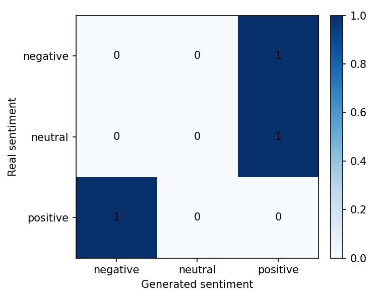
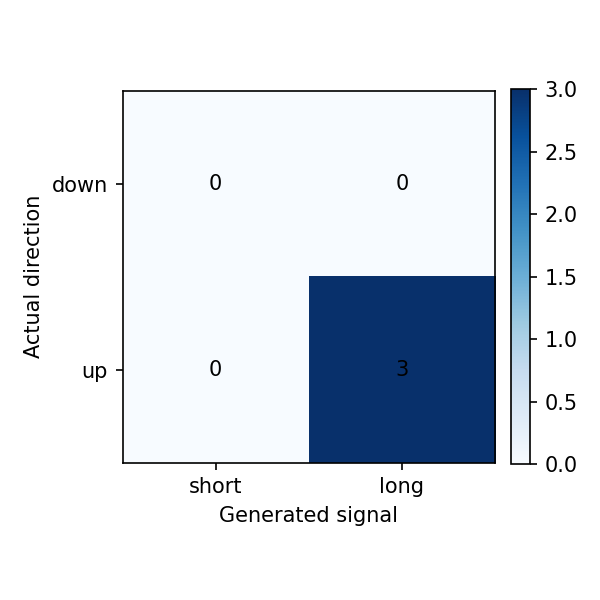

# Reporte del experimento

## Resumen

Este experimento fine-tunea `gpt2` para generar narrativas financieras de `AMD, NVDA` para el dia `t+1`, usando noticias y features de mercado de una ventana previa de `3` dias.

- Run: `baseline-gpt2-no-finetune_smoke`
- Estado: `completed`
- Duracion: `20.6` segundos

Tiempos por etapa:

| Etapa | Segundos |
|---|---:|
| generate_predictions | 18.6658 |
| evaluate | 1.9286 |

## Datos

- Dataset: `beachside1234/FNSPID`
- Activos configurados: `NVDA, AMD`
- Activos presentes en predicciones: `AMD, NVDA`
- Rango configurado: `2017-08-18` a `2023-12-16`
- Splits procesados: train=1517, val=325, test=326
- Predicciones evaluadas: 3

## Metodo

- Formato de entrada: ticker, fecha, retorno diario, volumen relativo, RSI y noticias previas.
- Target: outlook estructurado del dia siguiente con sentimiento, direccion y narrativa.
- Entrenamiento: causal language modeling con perdida enmascarada sobre el prompt.
- Modelo base: `gpt2`
- Epocas: `0`
- Learning rate: `5e-05`
- Decoding: `do_sample=False`, `max_new_tokens=120`

## Resultados Textuales

| Metrica | Media |
|---|---:|
| ROUGE-1 | 0.0413 |
| ROUGE-2 | 0.0000 |
| ROUGE-L | 0.0286 |
| BERTScore P | n/a |
| BERTScore R | n/a |
| BERTScore F1 | n/a |

Lectura: ROUGE bajo indica poca coincidencia literal con las noticias reales. BERTScore moderado sugiere cercania semantica general, probablemente influida por vocabulario financiero compartido.

## Resultados Semanticos

| Metrica | Valor |
|---|---:|
| Sentiment match accuracy | 0.0000 |
| Structured sentiment match accuracy | 0.0000 |
| Neutral baseline accuracy | 0.3333 |
| Mean KL divergence | 3.0462 |
| Net sentiment Pearson | -0.8924 |

Matriz real vs generado segun FinBERT:

| Real \ Generado | negative | neutral | positive |
|---|---:|---:|---:|
| negative | 0 | 0 | 1 |
| neutral | 0 | 0 | 1 |
| positive | 1 | 0 | 0 |

Lectura: el modelo tiende a neutralizar el tono. La evaluacion semantica no supera el baseline trivial de predecir siempre neutral.

## Resultados Financieros

| Metrica | Valor |
|---|---:|
| Filas joineadas | 3.0000 |
| Directional accuracy generado | 1.0000 |
| Directional accuracy noticia real | 0.5000 |
| Cobertura senal generada | 1.0000 |
| Cobertura senal real | 0.6667 |
| Accuracy alta volatilidad | 1.0000 |
| Accuracy baja volatilidad | 1.0000 |

Lectura: cuando el modelo genera una senal no neutral, la precision direccional es razonable, pero la cobertura es baja. Esto debe interpretarse como una senal selectiva, no como una estrategia completa.

## Ejemplos Cualitativos

### Caso con buena similitud textual

- Fecha target: `2023-04-19`
- Sentimiento real/generado: `negative` / `positive`
- Direccion real/senal generada: `1` / `1`

**Noticia real:**

> - PC Unit Sales Plunge in Q1, and TSMC Feels the Effects

**Noticia generada:**

> The Dow Jones Industrial Average is now at its highest level in more than two years and the Nasdaq Composite Index has gained nearly 10 percent since last week's close . The stock was trading above $100 on Tuesday morning after hitting an all time high of over 100 points as investors continued their bullish momentum ahead with new data showing that Apple Inc.'s iPhone 6S will be available this fall , while Samsung Electronics Co Ltd ' s Galaxy Note 7 smartphone may launch later next year or early 2018 depending upon how much demand it receives from consumers who are looking forward towards smartphones powered by Qualcomm Snapdragon 801 processors which

## Limitaciones

- GPT-2 small tiene capacidad limitada y tiende a generar titulares genericos.
- El target usa titulares agregados por dia, no articulos completos curados.
- FinBERT mide tono financiero, pero no garantiza causalidad ni prediccion de precio.
- La metrica financiera usa la direccion estructurada generada cuando esta disponible.
- La muestra de test es chica para concluir robustez estadistica.

## Proximos Experimentos

- Comparar contra mas epochs y contra GPT-2 medium si hay VRAM.
- Probar prompts mas estructurados con menos titulares y features mas claras.
- Ajustar decoding para reducir titulares clickbait/genericos.
- Extender a varios ETFs/tickers cuando el pipeline este estable.
- Agregar una tabla comparativa entre carpetas `runs/`.
