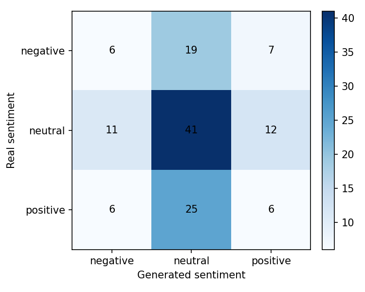
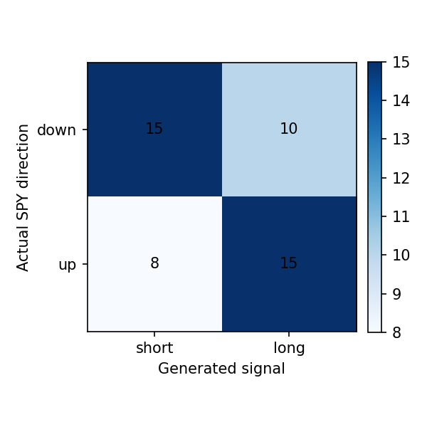

# Reporte del experimento

## Resumen

Este experimento fine-tunea `gpt2` para generar narrativas financieras de `SPY` para el dia `t+1`, usando noticias y features de mercado de una ventana previa de `3` dias.

## Datos

- Dataset: `beachside1234/FNSPID`
- Activos configurados: `SPY, QQQ`
- Activos presentes en predicciones: `SPY`
- Rango configurado: `2017-08-18` a `2023-12-16`
- Splits procesados: train=616, val=132, test=133
- Predicciones evaluadas: 133

## Metodo

- Formato de entrada: ticker, fecha, retorno diario, volumen relativo, RSI y noticias previas.
- Target: titulares/noticias del dia calendario siguiente.
- Entrenamiento: causal language modeling con perdida enmascarada sobre el prompt.
- Modelo base: `gpt2`
- Epocas: `3`
- Learning rate: `5e-05`
- Decoding: `do_sample=False`, `max_new_tokens=120`

## Resultados Textuales

| Metrica | Media |
|---|---:|
| ROUGE-1 | 0.0960 |
| ROUGE-2 | 0.0053 |
| ROUGE-L | 0.0682 |
| BERTScore P | 0.7340 |
| BERTScore R | 0.7380 |
| BERTScore F1 | 0.7358 |

Lectura: ROUGE bajo indica poca coincidencia literal con las noticias reales. BERTScore moderado sugiere cercania semantica general, probablemente influida por vocabulario financiero compartido.

## Resultados Semanticos

| Metrica | Valor |
|---|---:|
| Sentiment match accuracy | 0.3985 |
| Neutral baseline accuracy | 0.4812 |
| Mean KL divergence | 1.3610 |
| Net sentiment Pearson | -0.0569 |

Matriz real vs generado segun FinBERT:

| Real \ Generado | negative | neutral | positive |
|---|---:|---:|---:|
| negative | 6 | 19 | 7 |
| neutral | 11 | 41 | 12 |
| positive | 6 | 25 | 6 |

Lectura: el modelo tiende a neutralizar el tono. La evaluacion semantica no supera el baseline trivial de predecir siempre neutral.

## Resultados Financieros

| Metrica | Valor |
|---|---:|
| Filas joineadas | 132.0000 |
| Directional accuracy generado | 0.6250 |
| Directional accuracy noticia real | 0.6232 |
| Cobertura senal generada | 0.3636 |
| Cobertura senal real | 0.5227 |
| Accuracy alta volatilidad | 0.6522 |
| Accuracy baja volatilidad | 0.6000 |

Lectura: cuando el modelo genera una senal no neutral, la precision direccional es razonable, pero la cobertura es baja. Esto debe interpretarse como una senal selectiva, no como una estrategia completa.

## Ejemplos Cualitativos

### Caso con buena similitud textual

- Fecha target: `2023-07-13`
- Sentimiento real/generado: `negative` / `positive`
- Direccion real/senal generada: `1.0` / `1.0`

**Noticia real:**

> - Stocks Finish Higher as Easing Price Pressures Curb Interest Rate Concerns
> - Should BNY Mellon US Large Cap Core Equity ETF (BKLC) Be on Your Investing Radar?
> - PPI Lowest in 3 Years, Jobless Claims Lower

**Noticia generada:**

> - Stock Market Today Highlights Strong Volatility and Higher Interest Rates; Fed Touts Stimulus Plan to Lower Prices On Wall Street Concerned About Jobs Report

### Caso con sentimiento coincidente

- Fecha target: `2023-05-12`
- Sentimiento real/generado: `neutral` / `neutral`
- Direccion real/senal generada: `-1.0` / `0.0`

**Noticia real:**

> - Should Goldman Sachs ActiveBeta U.S. Large Cap Equity ETF (GSLC) Be on Your Investing Radar?
> - Top-Performing Internet ETF Flashes Buy Signals
> - Why Europe ETFs May Be Better Bets Than U.S.

**Noticia generada:**

> - 3 Top Stock Market News From July 11th 2017; 2 of Them Were Positive Stories from Investors and Futures Stocks Rally After Fed Decision On Q4 Earnings

### Caso con senal financiera correcta

- Fecha target: `2023-05-16`
- Sentimiento real/generado: `positive` / `negative`
- Direccion real/senal generada: `-1.0` / `-1.0`

**Noticia real:**

> - 5 Most-Loved ETFs of Last Week
> - ETFs to Tap the Surge in Japan Stocks
> - Small-Cap Industrial Tech Firm Energy Recovery is a Quiet Outperformer

**Noticia generada:**

> - Stock Markets Are Still on Their Edge as Investors Turn On Fed Chairwoman Janet Yellen's Speech; Wall Street Is Now In a Stupor

## Limitaciones

- GPT-2 small tiene capacidad limitada y tiende a generar titulares genericos.
- El target usa titulares agregados por dia, no articulos completos curados.
- FinBERT mide tono financiero, pero no garantiza causalidad ni prediccion de precio.
- La metrica financiera usa una regla simple de sentimiento a long/short/hold.
- La muestra de test es chica para concluir robustez estadistica.

## Proximos Experimentos

- Comparar contra mas epochs y contra GPT-2 medium si hay VRAM.
- Probar prompts mas estructurados con menos titulares y features mas claras.
- Ajustar decoding para reducir titulares clickbait/genericos.
- Extender a varios ETFs/tickers cuando el pipeline este estable.
- Agregar una tabla comparativa entre carpetas `runs/`.
